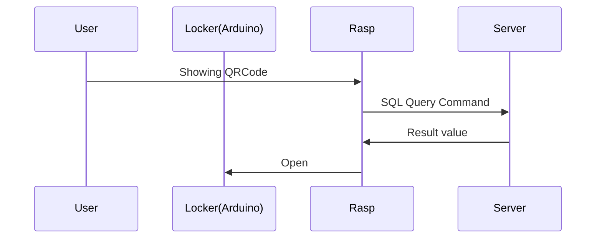
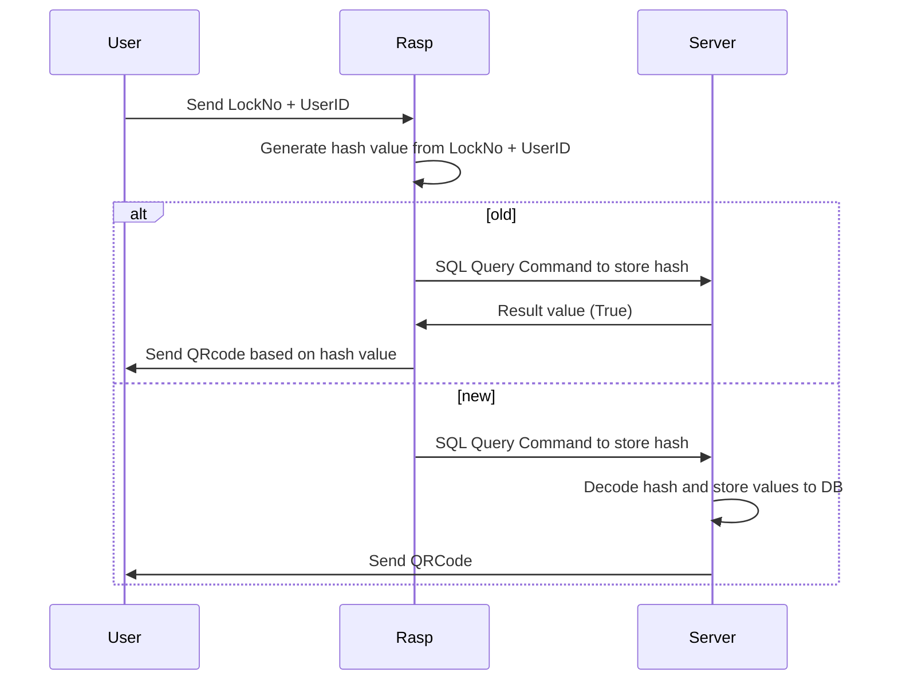

# 소스코드 구성

## 목차

- [QR코드](#QR코드)
  - [QR생성](#QR생성)
  - [QR인식](#QR인식)
  - [구현해보고싶은 사항](#선택구현사항)
- [해시](#해시)
- [통신](#통신)
- [SQL](#SQL)
- [동작 방식](#동작-방식)
  - [함이 열릴 때](#Open-Locker)
  - [QR코드 생성할 때](#Create-QRCode)
- [참고 사이트](#참고-사이트)

## QR코드

### QR생성

- 해당 메소드 실행 시 url값에 따른 QR코드가 생성되어지며 어떠한 오류 없이 생성되었을 경우 True를 리턴합니다.

  ```python
  >>> generateQR("SAMPLE URL")


  True
  ```

  단, 어떠한 이유로 인한 오류 발생 시 에러를 일으킵니다.

  ```python
  # 빈 문자열을 넣는 경우
  >>> generateQR("")


  ValueError
  ```

  ```python
  # 그 외 코드 실행중 오류가 발생한 경우
  >>> generateQR("test code")


  QRCode 생성 중 오류가 발생하였습니다. QRCodeError
  ```

### QR인식

- 해당 메소드를 실행하게 되면 라즈베리파이에 부착되어있는 카메라 모듈이 QR코드를 인식하는 기능으로 사용되게 됩니다.
  이 때 카메라에 QR코드를 나타낼 경우 해당 QR코드에 대한 정보를 반환합니다.

  ```python
  >>> detectQR()


  [("Hello World!", "QRCODE"), ("https://github.com/WhiteHyun", "QRCODE")]
  ```

  물론 카메라 오류가 발생할 경우 에러를 출력합니다.

  ```python
  # 에러가 발생했을 경우
  >>> detectQR()


  VideoError
  ```

### 선택구현사항

- QRCode에 이미지를 넣어 사물함 QR코드라는 것을 인식하게 만들기
  - 손실률이 발생하지만 충분히 복구 가능하기 때문에 구현 가능성 ⬆

## 해시

- 사물함의 정보와 사용자 또는 시간에 따른 정보를 결합한 url 값을 해시의 일종인 `SHA256` 로 암호화하여 전달합니다.

  ```python
  >>> encrypt('a')


  "ca978112ca1bbdcafac231b39a23dc4da786eff8147c4e72b9807785afee48bb"
  ```

## 통신

- `socket` 라이브러리를 사용하였으며 `TCP`로 통신합니다.
- 통신 포트는 `12000` 이 기본값입니다.

```python

>>> network.receiveDataToClient()
"The server is ready to receive"

>>> network.sendDataToServer("a")
"Received from (127.0.0.1), Message: 'a'"
```

## SQL

- `pymysql` 라이브러리를 이용하여 작성되었습니다.
- 연결할 DB와 상호작용하기위한 `cursor` 객체를 리턴합니다.

```python
>>> cursor, conn = connect_sql("admin", "1234", "127.0.0.1", "testdb")
>>> print(cursor, conn)


<pymysql.cursors.DictCursor object at 0x01C8E598> <pymysql.connections.Connection object at 0x01C8E658>

```

## 동작 방식

### Open Locker



### Create QRCode



## 참고 사이트

- [Generate QR code image with Python, Pillow, qrcode | note.nkmk.me](https://note.nkmk.me/en/python-pillow-qrcode/)

- [해시(hash)란?](https://medium.com/@yeon22/crypto-%ED%95%B4%EC%8B%9C-hash-%EB%9E%80-6962be197523)
