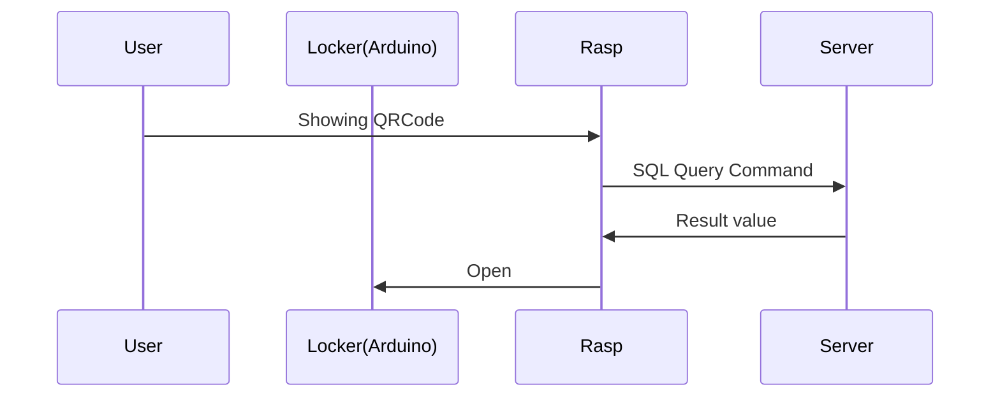
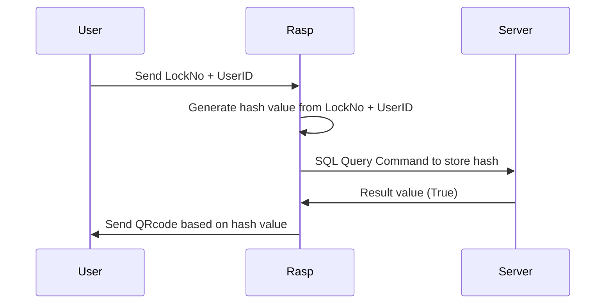

# 동작 차트

## Open Locker

```mermaid

sequenceDiagram
  participant User
  participant Locker(Arduino)
  participant Rasp
  participant Server
  User->>Rasp: Showing QRCode
  Rasp->>Server: SQL Query Command
  Server->>Rasp: Result value
  Rasp->>Locker(Arduino): Open

```

## Create QRCode

```mermaid

sequenceDiagram
  participant User
  participant Rasp
  participant Server
  User->>Rasp: Send LockNo + UserID
  Rasp->>Rasp: Generate hash value from LockNo + UserID
  Rasp->>Server: SQL Query Command to store hash
  Server->>Rasp: Result value (True)
  Rasp->>User: Send QRcode based on hash value

```
